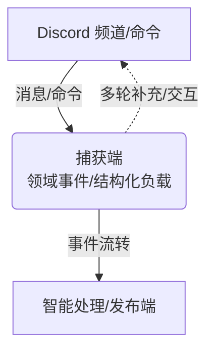

[](https://www.gnu.org/licenses/agpl-3.0)
[](https://chatmill.github.io/docs)
[](https://github.com/ChatMill/docs/pulls)
[](https://github.com/ChatMill/docs/commits/main)
[](https://github.com/ChatMill/docs/issues)
[](https://discord.gg/a6FUzTQApb)
[](https://github.com/ChatMill)

# Chatmill Discord Capture

> Chatmill 平台 IM 捕获端（以 Discord 为例） —— 团队对话驱动的自动化协作入口

---

## 项目简介

**discord-capture** 是 [Chatmill](https://github.com/ChatMill) 平台的 IM 捕获端子系统，专注于从 Discord 等主流 IM 工具自动捕捉频道消息、命令与用户输入，并将其结构化为后续智能处理（agent 能力插件）的原始数据。该模块作为 Chatmill 全流程自动化协作的起点，支持需求捕捉、内容生成、任务拆解、反馈收集等多种场景。

- 支持 Discord 消息监听、命令解析、Webhook 适配
- 领域驱动设计（DDD），高内聚、易扩展
- 与 Chatmill 智能处理与发布端解耦，支持多平台扩展
- 全链路 JWT 认证，保障接口安全

---

## 核心功能与流程

- **消息捕捉**：自动监听 Discord 频道消息、命令、用户输入，支持多种触发方式
- **结构化处理**：将原始消息转为领域事件与结构化负载，便于后续 agent 能力插件处理
- **事件流转**：通过事件机制与 Chatmill 智能处理端对接，实现多轮补充、确认、发布等流程
- **Webhook 支持**：支持外部平台回调，便于与发布端、第三方系统集成



---

## 目录结构

```text
discord-capture/
├── domain/                        # 领域层：核心业务对象、聚合、服务、事件、仓储接口
│   ├── entities/                  # 领域实体与聚合根
│   │   ├── session.py             # Session 聚合根，管理会话全生命周期
│   │   ├── message.py             # Message 实体，封装单条消息内容
│   │   └── structured_payload.py  # StructuredPayload 抽象及 Task/Checklist/ContentDraft 实现
│   ├── events/                    # 领域事件（Event 抽象及子类）
│   │   ├── base_event.py          # Event 抽象基类，统一事件通用字段
│   │   ├── initiate.py            # Initiate 事件，会话启动事件
│   │   ├── supplement_request.py  # SupplementRequest 事件，请求补充信息
│   │   ├── supplement_response.py # SupplementResponse 事件，补充信息响应
│   │   ├── confirmation.py        # Confirmation 事件，确认操作
│   │   └── publish_result.py      # PublishResult 事件，发布结果反馈
│   ├── services/                  # 领域服务
│   │   ├── session_service.py     # SessionService，会话业务规则与状态流转
│   │   ├── cml_event_relay_service.py # CmlEventRelayService，CML事件流转与分发
│   │   └── message_fetcher_service.py # MessageFetcherService，消息抓取与校验
│   ├── repositories/              # 仓储接口
│   │   ├── session_repository.py  # SessionRepository，会话持久化接口
│   │   ├── structured_payload_repository.py # StructuredPayloadRepository，结构化负载持久化接口
│   │   └── message_repository.py  # MessageRepository，消息持久化接口
│   └── value_objects/             # 值对象
│       └── message_range.py       # MessageRange，消息区间值对象
│
├── application/                   # 应用层：用例/流程编排、DTO、应用服务
│   ├── services/                  # 应用服务
│   │   └── command_service.py     # CommandService，用例编排与流程控制
│   ├── handlers/                  # 命令/事件处理器
│   │   └── session_handler.py     # SessionHandler，处理会话相关命令/事件
│   ├── dtos/                      # 数据传输对象
│   │   └── session_dto.py         # SessionDTO，会话数据传输结构
│   └── strategies/                # 策略分发/注册机制
│       └── payload_strategy.py    # PayloadStrategy，基于 agent 字段的策略分发
│
├── infrastructure/                # 基础设施层：持久化、平台适配、外部集成
│   ├── repositories/              # 仓储实现
│   │   ├── mongo_session_repository.py           # MongoDB SessionRepository 实现
│   │   ├── mongo_structured_payload_repository.py # MongoDB StructuredPayloadRepository 实现
│   │   └── mongo_message_repository.py           # MongoDB MessageRepository 实现
│   ├── platform/                  # 平台适配器
│   │   ├── discord_client.py      # Discord API 封装
│   │   └── discord_webhook.py     # Discord Webhook 适配
│   ├── webhook/                   # Webhook 适配
│   │   └── webhook_handler.py     # WebhookHandler，处理外部 webhook 回调
│   ├── persistence/               # 数据库连接、模型
│   │   └── mongodb.py             # MongoDB 连接与模型定义
│   └── config/                    # 配置与环境变量
│       └── settings.py            # Settings，环境变量与配置加载
│
├── interfaces/                    # 接口层：API、命令入口、webhook
│   ├── api/                       # FastAPI 路由
│   │   └── routes.py              # API 路由定义
│   ├── commands/                  # 命令解析
│   │   └── discord_commands.py    # Discord 命令解析与适配
│   ├── webhook/                   # Webhook 入口
│   │   └── discord_webhook_handler.py # Discord Webhook 入口处理
│   └── schemas/                   # API/消息体 schema
│       └── session_schema.py      # SessionSchema，API 数据结构定义
│
├── shared/                        # 跨层通用工具、CML协议、异常、日志
│   ├── cml/                       # CML 协议定义与解析
│   │   └── cml_protocol.py        # CML 协议结构、序列化/反序列化
│   ├── exceptions.py              # 通用异常定义
│   └── logger.py                  # 日志工具
│
├── main.py                        # 应用入口，依赖注入与启动
└── README.md                      # 项目说明文档
```

---

## 领域核心类图

下图展示了捕获端领域层的主要实体、聚合与关系，突出结构化负载的抽象与解耦。

图表说明：
- 图表采用 DDD 分层架构，分为 Domain、Application、Infrastructure 和 Interfaces 四层
- 每层包含其典型实现类，实际代码可根据需求扩展
- 校验点分布在不同层级，确保数据完整性和业务规则

```mermaid
classDiagram
  %% Domain Layer
  subgraph domain 
    class Session {
      +session_id: str
      +organization_id: str
      +project_id: str
      +participants: List[str]
      +history: List[str]
      +type: str
      +platform: str
      +agent: str
      +payload: StructuredPayload
    }

    class StructuredPayload {
      <<interface>>
      +external_id: str
      +message_ids: List[str]
    }

    class Task {
      +missspec_id: str
      +external_id: str
      +title: str
      +description: str
      +message_ids: List[str]
      +start_time: str
      +end_time: str
      +storypoints: float
      +assignees: List[str]
      +priority: str
      +parent_task: str
      +sub_tasks: List[Task]
      +history: List[str]
    }

    class Checklist {
      +external_id: str
      +message_ids: List[str]
      %% 其他字段由 agent 能力插件自定义
    }

    class ContentDraft {
      +external_id: str
      +message_ids: List[str]
      %% 其他字段由 agent 能力插件自定义
    }

    class Message {
      +id: str
      +author: str
      +content: str
      +timestamp: str
    }

    class Event {
      <<abstract>>
      +type: str
      +session_id: str
      +message_id: str
      +operator_id: str
      +payload: StructuredPayload
      +history: List[str]
    }

    class Initiate {
      // 无特有字段，全部继承自 Event
    }
  end

  %% Application Layer
  subgraph application 
    class CmlEventRelayService {
      +validate_event(event: dict): bool
      +dispatch_event(event: dict)
      +broadcast_to_im(event: dict)
      +verify_jwt_token(token: str): bool
    }

    class SessionService {
      +create_session(org_id: str, proj_id: str): Session
      +get_session(session_id: str): Session
      +update_participants(session_id: str, participants: List[str])
      +update_assignees(session_id: str, assignees: List[str])
      +validate_session_state(session: Session): bool
      +handle_state_transition(session: Session, event: dict)
    }

    class MessageFetcherService {
      +fetch_messages(message_ids: List[str]): List[Message]
      +validate_message_count(message_ids: List[str]): bool
      +fetch_message_range(start_id: str, end_id: str): List[Message]
    }

    class CommandService {
      +session_repository: SessionRepository
      +create_session(org_id: str, proj_id: str): Session
      +get_session(session_id: str): Session
      +update_session(session: Session)
      +handle_command(cmd: Command): Result
    }
  end

  %% Infrastructure Layer
  subgraph infrastructure 
    class SessionRepository {
      <<interface>>
      +save(session: Session)
      +get_by_id(session_id: str): Session
      +update(session: Session)
      +delete(session_id: str)
    }

    class StructuredPayloadRepository {
      <<interface>>
      +save(payload: StructuredPayload)
      +get_by_id(payload_id: str): StructuredPayload
      +update(payload: StructuredPayload)
      +delete(payload_id: str)
    }

    class MessageRepository {
      <<interface>>
      +save(message: Message)
      +get_by_id(message_id: str): Message
      +get_by_ids(message_ids: List[str]): List[Message]
    }

    class MongoSessionRepository {
      -client: MongoClient
      -db: Database
      +find_by_id(session_id: str): Session
      +save(session: Session)
      +update(session: Session)
      +delete(session_id: str)
    }

    class DiscordClient {
      -token: str
      -client: Client
      +get_message(message_id: str): Message
      +get_channel(channel_id: str): Channel
      +send_message(channel_id: str, content: str)
      +edit_message(message_id: str, content: str)
    }

    class DiscordWebhook {
      -webhook_url: str
      -client: WebhookClient
      +send(payload: dict)
      +send_embed(embed: Embed)
      +delete_message(message_id: str)
    }
  end

  %% Interfaces Layer
  subgraph interfaces 
    class DiscordCommands {
      +handle_capture(ctx: Context)
      +handle_supplement(ctx: Context)
      +handle_confirm(ctx: Context)
      +handle_publish(ctx: Context)
      +handle_modify(ctx: Context)
    }

    class WebhookHandler {
      +handle_github_event(event: Event)
      +handle_discord_event(event: Event)
      +process_callback(callback: Callback)
    }

    class ApiRoutes {
      +create_session(): Response
      +get_session(session_id: str): Response
      +update_session(session_id: str): Response
      +delete_session(session_id: str): Response
    }
  end

  %% 依赖关系
  interfaces --> application : 调用
  application --> domain : 依赖
  application --> infrastructure : 依赖
  infrastructure --> domain : 实现接口

  %% 领域层内部关系
  Session o-- StructuredPayload
  StructuredPayload <|.. Task
  StructuredPayload <|.. Checklist
  StructuredPayload <|.. ContentDraft
  Task "1" o-- "*" Task : sub_tasks
  Session "1" o-- "*" Message

  %% 服务与聚合根/实体依赖
  SessionService ..> Session : 管理/状态流转
  SessionService ..> StructuredPayload : 负载操作
  SessionService ..> Message : 消息聚合
  CmlEventRelayService ..> Session : 事件分发
  CmlEventRelayService ..> StructuredPayload : 事件分发
  MessageFetcherService ..> Message : 消息抓取
  CommandService ..> SessionService : 用例编排
  CommandService ..> CmlEventRelayService : 事件流转
  CommandService ..> MessageFetcherService : 消息抓取
  CommandService ..> SessionRepository : 仓储依赖

  %% 仓储接口与实现
  MongoSessionRepository ..|> SessionRepository
  StructuredPayloadRepository <|.. MongoSessionRepository
  MessageRepository <|.. MongoSessionRepository

  %% 实现关系
  DiscordClient ..> Message
  DiscordWebhook ..> WebhookHandler

  %% 校验节点
  class 校验点_1 {
    <<interfaces>>
    +命令格式校验
    +ID格式校验
    +@user有效性
    +GUILD_IDS白名单
  }
  class 校验点_2 {
    <<application>>
    +消息区间上限
    +参与人/责任人权限
    +session状态流转
  }
  class 校验点_3 {
    <<domain>>
    +session参与人不为空
    +事件树无环
    +发布后不可补充
  }

  class MessageRange {
    +start_id: str
    +end_id: str
    +as_list(): List[str]
  }

  class SupplementRequest {
    +question: str
    +required_fields: List[str]
  }

  class SupplementResponse {
    +supplement_messages: List[str]
  }

  class Confirmation {
    // 无特有字段，全部继承自 Event
  }

  class PublishResult {
    +platform: str
    +result: Result
  }

  class Result {
    +status: str
    +platform: str
    +url: str
    +message: str
    +id: str
  }

  %% 关系
  Session "1" o-- "*" Message
  Session "1" o-- "*" StructuredPayload
  SupplementRequest "1" o-- "1" StructuredPayload
  SupplementResponse "1" o-- "1" StructuredPayload
  Confirmation "1" o-- "1" StructuredPayload
  PublishResult "1" o-- "1" StructuredPayload
  PublishResult "1" o-- "1" Result

  %% 校验点关联
  Session .. 校验点_1
  Session .. 校验点_2
  Session .. 校验点_3

  %% 事件关系
  Event <|-- SupplementRequest
  Event <|-- SupplementResponse
  Event <|-- Confirmation
  Event <|-- PublishResult
  Event <|-- Initiate

  %% Initiate：会话启动事件，继承 Event，无特有字段。
```



领域模型说明：
- StructuredPayload 是所有 agent 能力插件结构化负载的抽象接口，捕获端领域层只依赖该接口。
- Task 是 Miss Spec agent 的 StructuredPayload 实现，其他 agent（如 Nudge、Echo）可有自己的实现（如 Checklist、ContentDraft）。
- 捕获端领域事件、Session、SupplementRequest、PublishResult 等均与 StructuredPayload 关联，实现平台与业务解耦。
- 具体业务结构仅在 agent 领域层定义和扩展。

---

> 依赖/调用关系说明：
> - interfaces 层通过 application 层服务调用领域服务和仓储接口
> - application 层服务（如 CommandService）依赖领域服务（SessionService、CmlEventRelayService、MessageFetcherService）和仓储接口
> - 领域服务依赖聚合根（Session）、结构化负载（StructuredPayload）、消息（Message）等实体，负责业务规则和状态流转
> - 仓储实现（如 MongoSessionRepository）实现仓储接口，负责实体持久化
> - Session 的 agent 字段用于策略分发，动态选择 StructuredPayload 的具体实现（如 Task、Checklist、ContentDraft）
> - 事件流和策略分发链路通过服务和 agent 字段实现高度解耦和可扩展

> Event 抽象基类统一了所有领域事件/命令的通用字段（type、session_id、message_id、operator_id、payload、history），便于事件流转、权限校验、日志追踪等通用处理。各子类仅补充自身特有字段。

---

## 扩展与定制

- 支持自定义领域事件、结构化负载（StructuredPayload）与 agent 能力插件
- 支持多平台 IM 捕获端扩展（如 Slack、Telegram）
- 所有协议与中间结果统一采用 CML（Chatmill Language），兼容 YAML/JSON
- 支持标准 JWT 认证机制，便于与第三方平台安全集成
- 贡献指南见 developer/CONTRIBUTING.md
- 架构与领域建模详见 developer/ARCHITECTURE.md

---

## JWT 认证与加密实践

Chatmill 捕获端（discord-capture）所有 API、Webhook、事件流等敏感操作均采用 JWT（JSON Web Token）认证机制，保障平台各端通信的身份可信与数据安全。

### 1. JWT 用途
- 捕获端作为签发方（iss: "discord-capture"），为下游 agent、发布端等生成认证 token
- 捕获端作为接收方（aud: "discord-capture"），校验上游/外部请求的身份与权限
- 支持多平台、多 agent、多租户安全扩展

### 2. JWT 字段规范

#### Header
| 字段名 | 说明       | 示例值         |
|-----|----------|-------------|
| alg | 签名算法     | HS256/RS256 |
| typ | Token 类型 | JWT         |

#### Payload
| 字段名 | 说明                      | 必填  | 示例值               |
|-----|-------------------------|-----|-------------------|
| sub | 主题（session_id，会话唯一标识）   | 是   | "sess-001"        |
| exp | 过期时间（Unix 时间戳）          | 是   | 1718000000        |
| iat | 签发时间（Unix 时间戳）          | 是   | 1717990000        |
| aud | 受众（接收方微服务/agent唯一英文标识）  | 是   | "miss-spec-agent" |
| iss | 签发方（签发方微服务/agent唯一英文标识） | 是   | "discord-capture" |

> 建议所有字段均为必填，aud/iss 字段用于微服务/agent 身份校验。

### 3. Python 签发与验证示例

#### 对称加密（HS256）
```python
import jwt
import time

SECRET_KEY = "your_secret_key"
payload = {
    "sub": "sess-001",  # 主题为 session_id
    "exp": int(time.time()) + 3600,  # 1小时后过期
    "iat": int(time.time()),
    "aud": "miss-spec-agent",  # 接收方唯一标识
    "iss": "discord-capture"   # 签发方唯一标识
}
token = jwt.encode(payload, SECRET_KEY, algorithm="HS256")
print(f"JWT Token: {token}")

# 验证 JWT
try:
    decoded = jwt.decode(
        token,
        SECRET_KEY,
        algorithms=["HS256"],
        audience="miss-spec-agent",
        issuer="discord-capture"
    )
    print("Decoded payload:", decoded)
except jwt.ExpiredSignatureError:
    print("Token expired!")
except jwt.InvalidTokenError:
    print("Invalid token!")
```

#### 非对称加密（RS256）
```python
import jwt
from pathlib import Path
import time

private_key = Path("private.pem").read_text()
public_key = Path("public.pem").read_text()

payload = {
    "sub": "sess-001",
    "exp": int(time.time()) + 3600,
    "iat": int(time.time()),
    "aud": "miss-spec-agent",
    "iss": "discord-capture"
}
token = jwt.encode(payload, private_key, algorithm="RS256")
print(f"JWT Token: {token}")

try:
    decoded = jwt.decode(
        token,
        public_key,
        algorithms=["RS256"],
        audience="miss-spec-agent",
        issuer="discord-capture"
    )
    print("Decoded payload:", decoded)
except jwt.ExpiredSignatureError:
    print("Token expired!")
except jwt.InvalidTokenError:
    print("Invalid token!")
```

### 4. 最佳实践
- 所有 API、Webhook、Agent 通信必须启用 JWT 认证
- 生产环境建议使用非对称加密（RS256），密钥分离，提升安全性
- Token 有效期建议 1-2 小时，过期需重新签发
- 必须校验 aud/iss 字段，确保 token 只被指定微服务/agent 接收和签发
- 密钥/公钥应通过安全渠道分发与管理，严禁硬编码在代码仓库

### 5. 相关文档
- [CML 协议与事件类型](developer/CML_PROTOCOL.md)
- [平台适配与配置](deployment/PLATFORM_ADAPTERS.md)
- [架构与分层设计](developer/ARCHITECTURE.md)

---

## 贡献与开发

- 欢迎提交 PR、issue 或参与文档完善
- 贡献指南见 developer/CONTRIBUTING.md
- 架构与领域建模详见 developer/ARCHITECTURE.md

---

## License

✅ GNU Affero General Public License v3.0 (AGPL-3.0)

---

## 社区与支持

- [主项目 Chatmill](https://github.com/ChatMill)
- [官方文档](https://chatmill.github.io/docs)
- [Discord 社区](https://discord.gg/a6FUzTQApb)
- [反馈与讨论](https://github.com/ChatMill/docs/issues) 